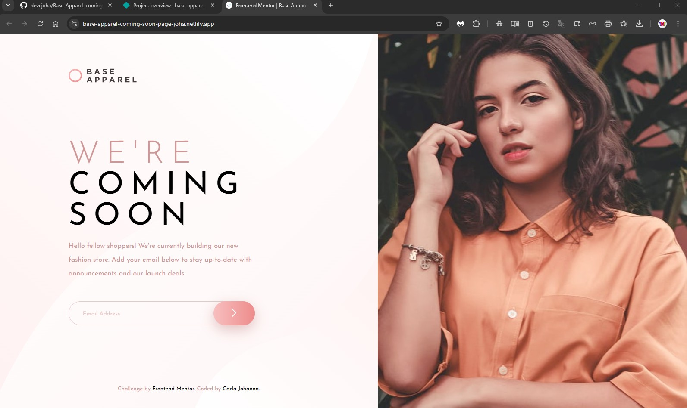
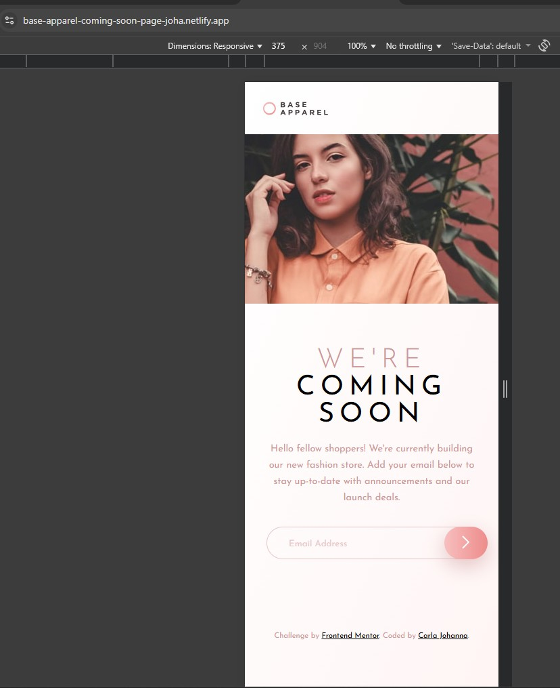
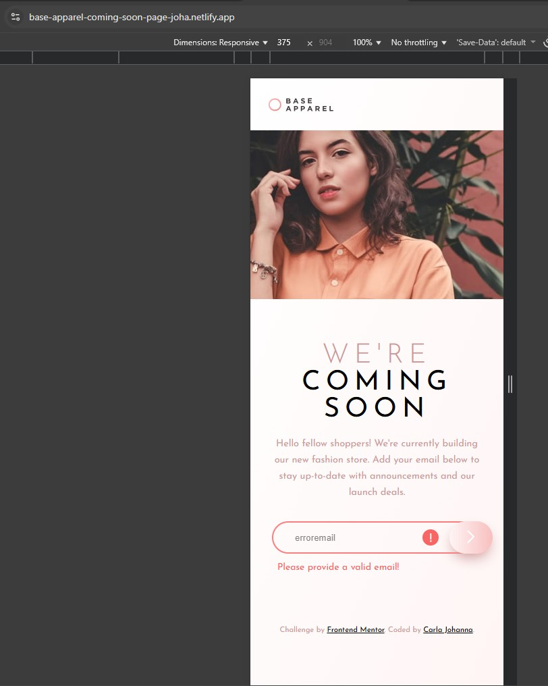

# Frontend Mentor - Base Apparel coming soon page solution

This is a solution to the [Base Apparel coming soon page challenge on Frontend Mentor](https://www.frontendmentor.io/challenges/base-apparel-coming-soon-page-5d46b47f8db8a7063f9331a0). Frontend Mentor challenges help you improve your coding skills by building realistic projects.

## Table of contents

- [Frontend Mentor - Base Apparel coming soon page solution](#frontend-mentor---base-apparel-coming-soon-page-solution)
  - [Table of contents](#table-of-contents)
  - [Overview](#overview)
    - [The challenge](#the-challenge)
    - [Screenshot](#screenshot)
    - [Links](#links)
  - [My process](#my-process)
    - [Built with](#built-with)
    - [What I learned](#what-i-learned)
    - [Continued development](#continued-development)
  - [Author](#author)

## Overview

### The challenge

Users should be able to:

- View the optimal layout for the site depending on their device's screen size
- See hover states for all interactive elements on the page
- Receive an error message when the `form` is submitted if:
  - The `input` field is empty
  - The email address is not formatted correctly

### Screenshot

  
  &nbsp;&nbsp;&nbsp;&nbsp;&nbsp;&nbsp;
  
  &nbsp;&nbsp;&nbsp;&nbsp;&nbsp;&nbsp;
  

### Links

- Solution URL: [Code](https://github.com/devcjoha/Base-Apparel-coming-soon-page-solution)
- Live Site URL: [Deploy](https://base-apparel-coming-soon-page-joha.netlify.app/)

## My process

### Built with

 &nbsp;&nbsp;&nbsp;&nbsp;&nbsp;&nbsp;

 &nbsp;&nbsp;&nbsp;&nbsp;&nbsp;&nbsp;

 &nbsp;&nbsp;&nbsp;&nbsp;&nbsp;&nbsp;

 &nbsp;&nbsp;&nbsp;&nbsp;&nbsp;&nbsp;

- Semantic HTML5 markup
- CSS custom properties
- Flexbox
- CSS Grid

### What I learned

This project gave me valuable experience in stabilizing complex layouts and synchronizing CSS and JavaScript.

1. Stabilizing Overlapping Elements with Absolute Positioning
   The biggest challenge was preventing the input field from shifting when the submit button was clicked. The solution was as follows:

    The row container (.input-container) was set to position: relative;.

    The submit button and error icon were set to position: absolute; and positioned with right: 0; and bottom: 1rem; respectively. This technique removes them from the Flexbox flow, preventing click or hover events (which resize the element) from destabilizing the adjacent input.

2. JavaScript-CSS Visibility Management
   I resolved the visibility issues by ensuring that:

    The .hidden class was solely responsible for display: none; in the CSS.

    The HTML hidden attribute was removed to prevent it from being overridden by JavaScript's removal of the class.

    All DOM variables (errorIcon, errorMsg) were fetched only once at startup (DOMContentLoaded) to ensure the displayError function always had valid references.

3. Validation and UX
   Robust validation was implemented using:

    A Regular Expression (Regex) to check the email format.

    An input listener to dynamically clear errors in real time, improving the user experience (UX).

### Continued development

My future focus will be on improving accessibility (A11y), particularly in forms, by applying aria-live and aria-describedby attributes to enable screen readers to announce error messages to the user.

## Author

- Website - [Carla Johanna](https://github.com/devcjoha)
- Frontend Mentor - [@devcjoha](https://www.frontendmentor.io/profile/yourusername)
- X - [@CarlitaJohanna](https://www.x.com/carlitajohana)

